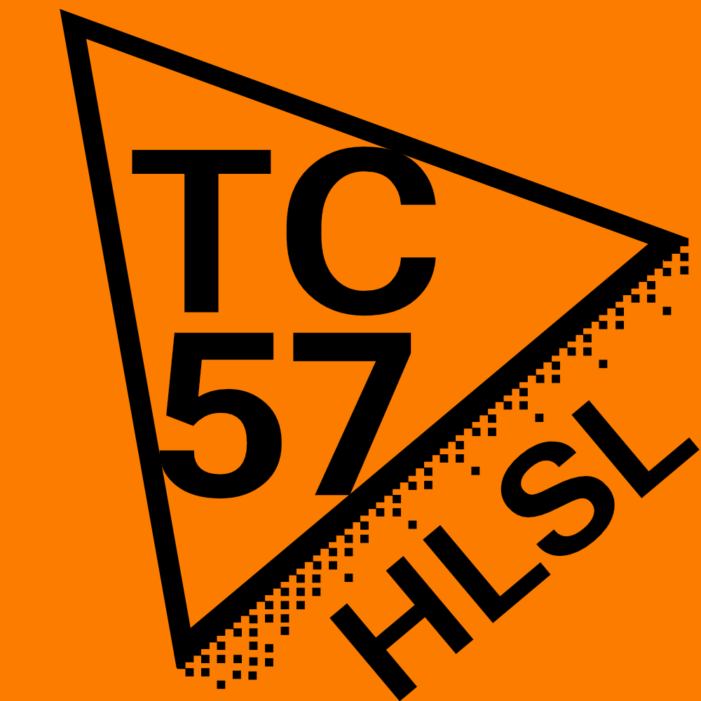

# Ecma TC57 - The HLSL Standard Committee

[](https://github.com/microsoft/hlsl-specs/actions/workflows/hugo.yml)

This repository documents and tracks the specification and evolution process for
the HLSL programming language under Ecma Technical Committee 57 (TC57). This
repository is made public to provide visibility into the feature development
process and solicit feedback from the wider community.

To understand the processes used by the Technical Committee please review our
[process documentation](docs/Process.md).

The draft HLSL specification is available in
[HTML](https://llvm-beanz.github.io/tc57/spec/index.html) and
[PDF](https://llvm-beanz.github.io/tc57/spec/hlsl.pdf).

## Building the Specification

The text for the HLSL specification is under the [`spec`](/spec/) directory. It
is written in LaTeX. Building the spec requires a TeX environment and some
additional tools each described below.

* The recommended LaTeX environment can be satisfied by installing [TeX
  Live](https://tug.org/texlive/).
* [Inkscape](https://inkscape.org) is required for rendering SVG into PDF.
* The HTML version of the specification is generated with
  [Pandoc](https://pandoc.org).
* [CMake](https://cmake.org) is used to generate makefiles or other build
  scripts.

After installing the dependencies you can build the specification with the
following commands:

```
mkdir build
cmake -G "Unix Makefiles" ../spec
make
```

The build has 3 targets to build the specification in different ways:
* html-chunked - one HTML file per clause and an index.
* html - one _giant_ HTML file.
* pdf

### MacOS using Homebrew

```
brew install --cask mactex
brew install inkscape
brew install pandoc
brew install cmake
```

### Ubuntu

```
sudo apt install texlive
sudo apt install texlive-latex-extra
sudo apt install inkscape
sudo apt install pandoc
sudo apt install cmake
```
