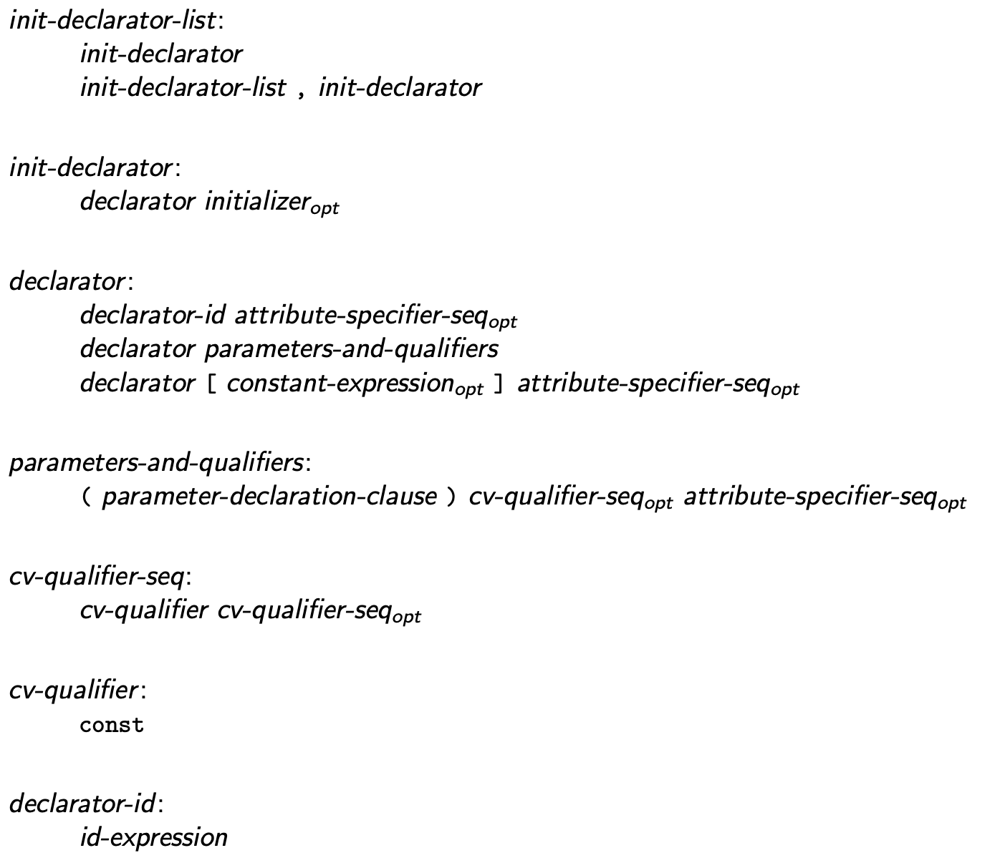

* Planned Version: 202x
* PRs: [#634](https://github.com/microsoft/hlsl-specs/pull/634)

## Implementation Status

|   | DXC     | Clang    |
|---|---------|----------|
| Restricting unbound array declarations | Not Started | Not Started |

## Introduction

New restrictions imposed on where declarators of arrays of unknown size can be
used legally in HLSL.

## Motivation

Arrays of unknown size cause a variety of problems within HLSL. When used as
parameters they cannot be copied in and out which violates the base calling
convention. For resource arrays, passing arrays of unknown size makes resource
initialization fragile across call boundaries.

Since the behavior of out of bounds accesses is undefined, losing the array
bound information at the source level and in the calling convention is rife with
potential pitfalls.

## Proposed solution

This proposal suggests limiting declarators of arrays of unknown size to:
* Global declarations of resources.
* Variables where an initializer is provided and the array bound is implied by
  the initializer.

## Detailed design

### Subscript [Expr.Post.Subscript]

A _postfix-expression_ followed by an expression in square brackets
(`[ ]`) is a subscript expression. In an array subscript expression of
the form `E1[E2]`, `E1` must have array, vector, or matrix of `T[]`
type, or type `T` where `T` provides an overloaded implementation of
`operator[]` (\ref{Overload}).

If the postfix expression `E1` is of array, vector or matrix type, the
expression `E2` must be a value of integer type, or of a type that is
implicitly convertible to integer type. If the value is known at compile
time to be outside the range `[0, N-1]` where `N` is the number of
elements in the vector, array, or matrix, the program is ill-formed. If the value is outside the
range at runtime, the behavior is undefined.


### Declarators [Decl.Decl]

```latex
\Sec{Declarators}{Decl.Decl}

\begin{grammar}
  \define{init-declarator-list}\br
  init-declarator\br
  init-declarator-list \terminal{,} init-declarator\br

  \define{init-declarator}\br
  declarator \opt{initializer}\br

  \define{declarator}\br
  declarator-id \opt{attribute-specifier-seq}\br
  declarator parameters-and-qualifiers\br
  declarator \terminal{\lbrack} \opt{constant-expression} \terminal{\rbrack} \opt{attribute-specifier-seq}\br

  \define{parameters-and-qualifiers}\br
  \terminal{(} parameter-declaration-clause \terminal{)} \opt{cv-qualifier-seq} \opt{attribute-specifier-seq}\br

  \define{cv-qualifier-seq}\br
  cv-qualifier \opt{cv-qualifier-seq}\br

  \define{cv-qualifier}\br
  \terminal{const}\br

  \define{declarator-id}\br
  id-expression

\end{grammar}
```


#### Arrays [Decl.Array]

In a declaration $T D$ where $D$ has the form:

```latex
\begin{innergrammar}
  \terminal{D1} \terminal{\lbrack} \opt{constant-expression} \terminal{\rbrack} \opt{attribute-specifier-seq}
\end{innergrammar}
```

The type of the entity declared in a declaration $T D1$ is $T\prime$, the derived type
$T$. The type of the entity declared in the declarator $D$ is $T\prime[N]$. The
_constant-expression_ shall be a converted constant expression of unsigned
integer type. Its value $N$ specifies the number of elements in the array,
called the _array bound_.

If present, $N$ must be greater than zero. If not present, the declaration must
be a global declaration of an object of a resource type (\ref{Resources});
otherwise the program is ill-formed.
